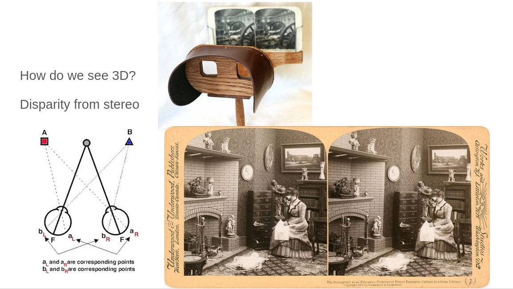

# Learning 3D Vision (geometric approach to computer vision)

A visual system is a collection of devices that transform measurements of light intensity into estimates of geometric properties of the
environment.

The human visual system measures the intensity of light incident the retinas and processes the measurements in the brain
to produce an estimate of the three-dimensional layout of the scene that is sufficient, for instance, to reach for an object in the scene and grasp it.


**3D Vision** is the field of computer vision which deals with the study of recovering three-dimensional information (e.g., shape or layout) of a scene from its two-dimensional image(s).Given images, **3d vision** infer the motion and shapes .


The geometric understanding  of the environment is required in order to move within the environment , detect , recognize and fetch the object .


## What is mean by  image for 3d vision ?

In 3d vision , we define image as the projection of real world into the plane . 

There are 3 type of projection :

1. Perspective Projection
2. Orthographic Projection
3. Weak Perspective Projection

We will only consider **Perspective projection** mostly while studying 3d Vision .


## How human vision perceive geometrical understanding ?

**Why does the chicken move its head all the time?**


```We move in order to see and see in order to move- William Gibson```

The image of a scene on the left eye is different from the image on the right eye. Their “difference”, known as Da Vinci stereopsis, can be used to infer the three-dimensional structure of the scene.
Stereo is exploited by the human visual system to infer the “depth” structure of the scene in the close-range

In addition to the stereopsis , we infer our previous knowledge of the environment .




## Mathematical Approach
In spite of numerous   cues such as texture, shading, T-junctions, cast shadows etc. We cannot only depends on these clues for geometrical properties and depth is necessary, We have already lost depth information in 3d to 2d projection (Image Formation).

But similar to stereopsis in human vision system , We can calculate depth properties using sequence of moving images.Mathematical problems raised in this context can be roughly thought as result of the interplay of two fundamental and important transformations : 

1. <span style="color:#7c0983;">The motion of camera</span>[orange]  : Which is also called **rigid body motion** i.e Euclidean Motion , has been a classic subject in geometry, physics (especially mechanical physics), and robotics.

2. <span style="color:blue;">The formation of image </span>[blue] : Which is also called **Perspective projection** , has been a widely studied subject in projective geometry and computer graphics.


## Reference 


1.  _An Invitation to 3D Vision_ [link](http://vision.ucla.edu/MASKS/)
2.  Talk on 3D vision by [Dr. Ajad Chhatkuli](https://scholar.google.co.uk/citations?hl=en&user=3BHMHU4AAAAJ)
3.  [Introduction to Computer Vision](https://classroom.udacity.com/courses/ud810/) on Udacity
