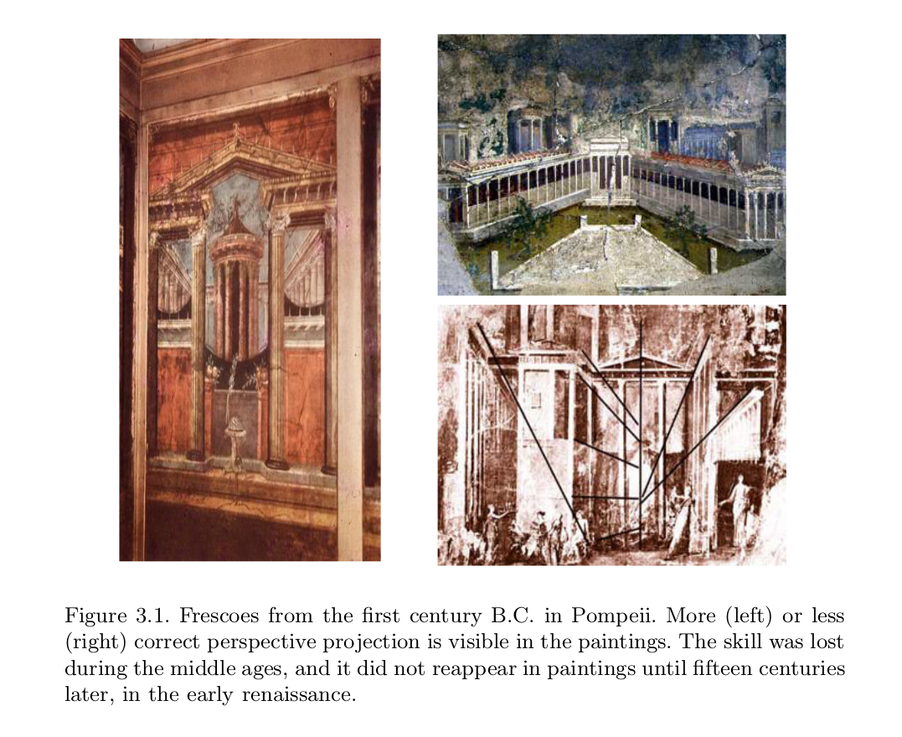
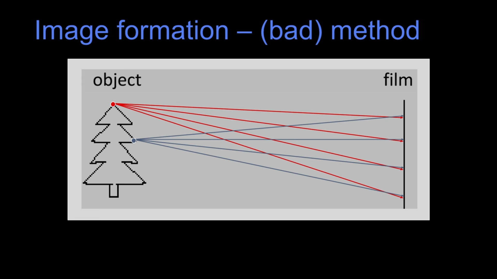
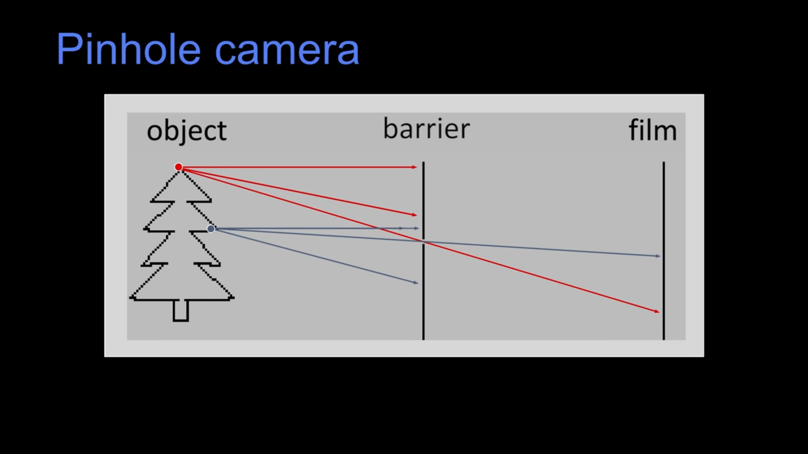
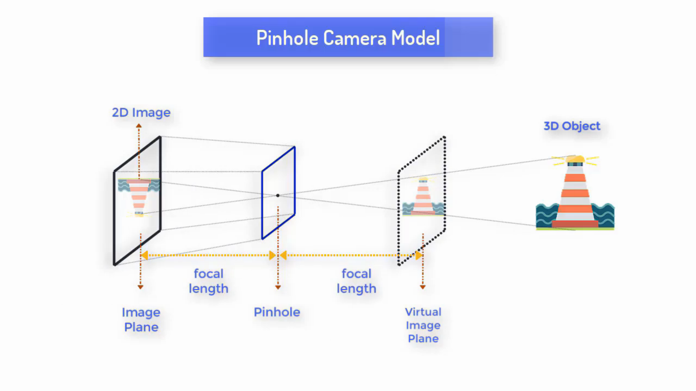
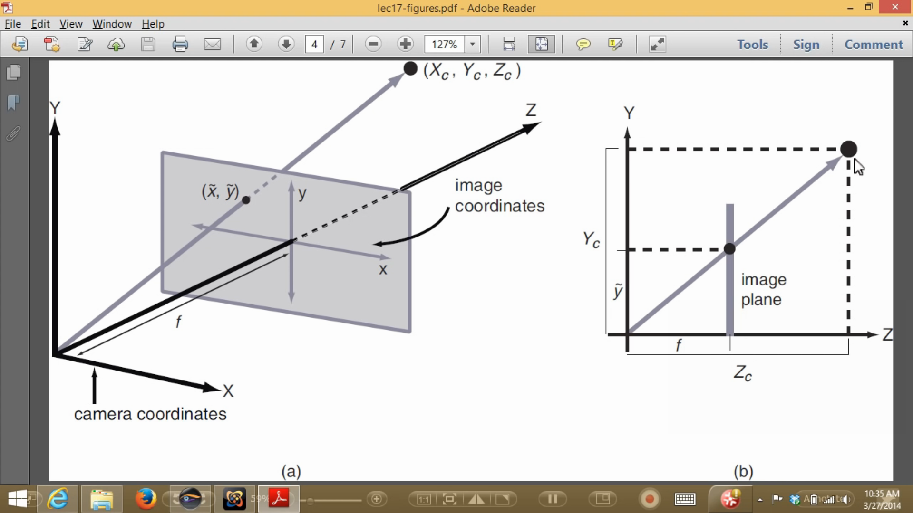
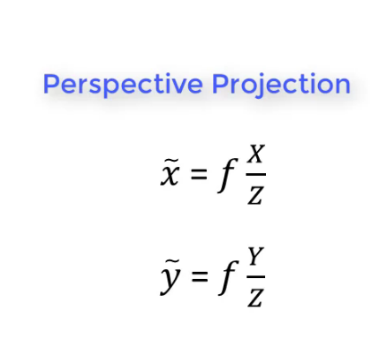

# Image Formation

3D Vision is the inverse problem of **image formation**. Image formation studies how objects give raise to images, 3D Vision attempts to use images to recover a description of objects in
space. Therefore, designing vision algorithms requires first developing a suitable model of image formation.


The roots to formalizing the geometry of image formation into a mathematical model can be traced back to the work of **Euclid** in the 6th century





## Representation of Image


An image, as far as 3D is concerned is projection of  three-dimensional world onto a plane i.e two-dimensional brightness array.

In other words, it is a map I, defined on a compact region Ω of a two-dimensional surface, taking values in the positive reals. For instance, in the case of a camera, Ω is a planar, rectangular region occupied by the
photographic medium (or by the CCD sensor), so that we have:

```
(x, y) → I(x, y)
```

The values taken by the map I depend upon physical properties of the scene being viewed, such as its shape, its material reflectance properties
and the distribution of the light sources.


## Camera Model


Let's talk about how you might make an image.So, here's an idea, let's just take a piece of film, or a sensor, and, let's just expose it to the light.




Do we get a reasonable picture, well, and the fact that the title says image formation, bad method should give it away.
Well, this point on top of this cartoon pine tree,well it projects, a ray of light to some point on the film. But of course  it also projects a ray of light all over the film.

Likewise, another point projects all over the film.So, one of the problems is that every location on the film is seeing light from all sorts of different places, there's no single, value of light that would,
that comes from a single place in the world.
 
_So how might we fix that ?_

Let's put in a barrier, a barrier with a very small hole in it. So here we have this little, a hole, and it's called an aperture. This is called
_Pinhole Camera Model_. 


Let's learn math behind this .....


## Perspective Projection

In Pinhole Camera Model, conceptually, all light passes through a vanishingly small pinhole placed at the origin and illuminates an image plane beneath it. 
 
 
 
The images formed on the image plane follow the laws of projective geometry. When using a pinhole camera model, this geometric mapping from 3D to 2D is called as perspective projection.
 

At first let's study about co-ordinate system being used




 1. Camera Co-ordinate System (Xc,Yc,Zc)
 2. Image Plane Co-ordinate System (x,y)
 3. Pixel Co-ordinate System (u,v)
 
 We have not consider the world co-ordinate system as we consider only one camera .
 
 
If you watch over the  2D view right side , you can clearly see the similar triangle . The relation between
Z and f is similar to that of between Y and y . The Final equation of the perspective projection is :
The co-ordinate on the image plane relative to world co-ordinate is inversely proportional to distance (Z) and directly proportional to the focal length of camera .




 
 