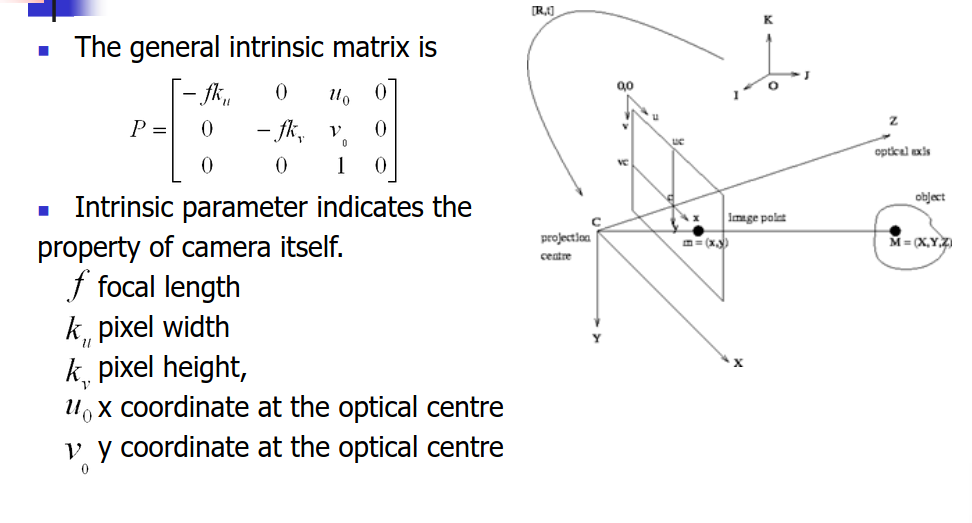
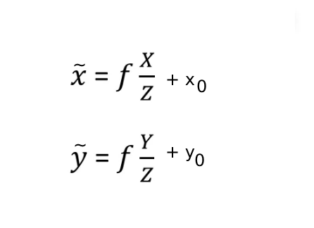
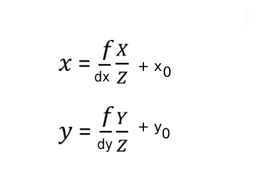
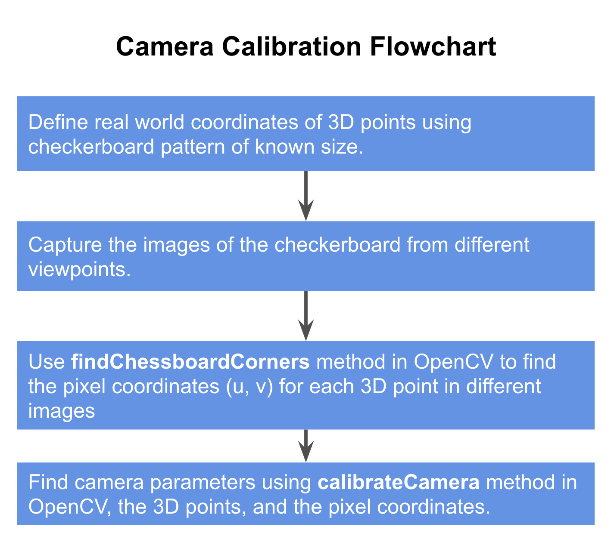

# Intrinsic Parameter

Intrinsic Parameter indicate the property of camera itself .

The previous perspective projection equation : 

The ~ above the image co-ordinate depicts this does not completely describe Pinhole Camera Model
 and there are other camera parameter need to be considered :
 
 1. Transformation between Optical Center and Camera Center 
 2. Changing the unit ( meter to pixel )

### Transformation between Optical Center and Camera Center 

X0 and Y0 are the camera center.

### Changing the unit ( meter to pixel )

dx and dy denote the pixel height and width

## Camera Calibration for Intrinsic Parameter

### 1. 2D-2D : Corresponding points on two images

    1. Using Pattern like chessboard :
    
    
    
    
    2. From Stream of images :
    
    Steps:
    
        1. Capture the images of the Rich Texture Surface from different Viewpoints
        
        2. Use RANSAC to find the fundamental Matrix
        
        2. then use SVD to get least square solution for Intrinsic parameter

#### Fundamental Matrix 

Fundamental Matrix describe the epi-polar geometry , it relate co-ordinate of same 3D points on different images.

### 2. 3D-2D : Corresponding points between 3D world and the image 

    Using standard intrinsic parameter equation.

